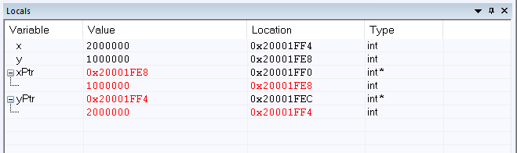
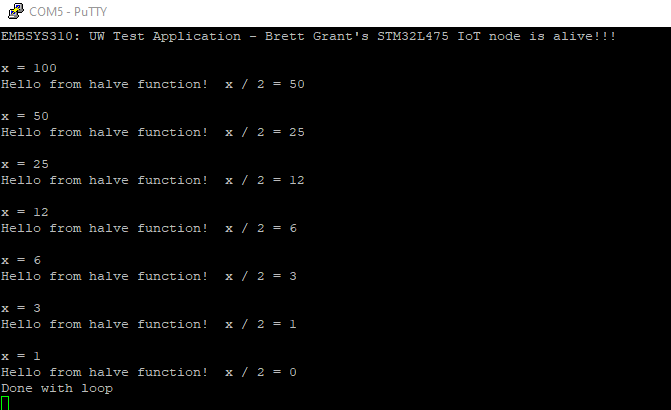

# Assignment 05

1\.  
&nbsp;&nbsp;a) I'm not sure what you are really asking for here.  In order for the code to work, the local variables have to be set up, and the pointers need to be set to the address of the local variables.  I guess that while this is done in main, I don't think of it as something that the "main" function does.  
&nbsp;&nbsp;b)  In my implementation, R0 & R1 are the addresses of the input parameters.  Since these are double pointers, they are the addresses of the pointers.  
  
&nbsp;&nbsp;c) 
  
  
  
2\.  
&nbsp;&nbsp;f) 

	
